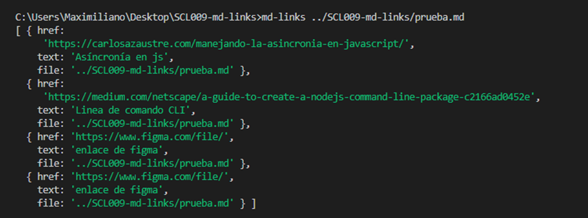
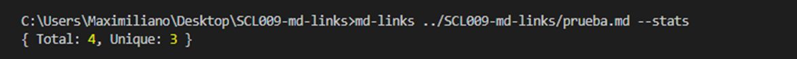

# Markdown Links, mlemus-md-links

## Preámbulo

Markdown es un lenguaje de marcado ligero muy popular entre developers. Es usado en muchísimas plataformas que manejan texto plano (GitHub, foros, blogs, ...), y es muy común encontrar varios archivos en ese formato en cualquier tipo de repositorio (empezando por el tradicional README.md).

Estos archivos Markdown normalmente contienen links (vínculos/ligas) que muchas veces están rotos o ya no son válidos y eso perjudica mucho el valor de la información que se quiere compartir.

Dentro de una comunidad de código abierto, nos han propuesto crear una herramienta usando Node.js, que lea y analice archivos en formato Markdown, para verificar los links que contengan y reportar algunas estadísticas.

## Introducción

Node.js es un entorno de ejecución para JavaScript construido con el motor de JavaScript V8 de Chrome. Esto nos va a permitir ejecutar JavaScript en el entorno del sistema operativo, ya sea tu máquina o un servidor, lo cual nos abre las puertas para poder interactuar con el sistema en sí, archivos, redes, ...

En este proyecto nos alejamos un poco del navegador para construir un programa que se ejecute usando Node.js, donde aprenderemos sobre cómo interactuar con el sistema archivos, con el entorno (proceso, env, stdin/stdout/stderr), ...

## Objetivos

El objetivo práctico de este proyecto era aorender a cómo crear una librería (o biblioteca - library) en JavaScript.

## Estructura del programa

El programa se estructura de la siguiente manera:

Imagen 1. Diagrama de flujo del programa.

La ruta ingresada por el usuario comienza a ser evaluada para saber si ésta es un directorio o si es un archivo. Los archivos Markdown encontrados serán evaluados para capturar sus links. Según la opción ingresada por el usuario se obtendrá diferente información que será mostrada en el terminal. En dado caso que el usuario no ingrese opciones, hay una opción por default que entregará información básica de los links evaluados.

## Instalación

Se debe ingresar en consola el siguiente comando:

<code> npm i mlemus-md-links </code>

## Guía de uso

Al ingresar solo la ruta, el usuario recibirá:

* file,
* href y
* text

Tal como indica la siguiente imagen

Imagen 2. Opción por default.

### Options

-- validate

Al usar la opción <code> --validate </code> podrás obtener:

* file,
* href,
* status,
* statusText y 
* text

Imagen 3. Opción validate

-- stats

Con <code> --stats </code> podrás obtener:

* links TOTALES y
* UNIQUES

Imagen 4. Opción stats.

--stats --validate

<code> --stats --validate </code>

Con este combo puedes obtener:

* links TOTALES,
* UNIQUES y
* BROKEN

Imagen 5. Opción stats y validate.

## Planificación

Este proyecto se planificó en un tiempo de un poco más de dos semanas.

Se usó [Trello(dale click)](https://trello.com/b/yapPwKrm/scl009-md-links) para organizar el tiempo.

## Documentación técnica
### Dependencias:

* chalk
* filehound
* marked
* node-fetch